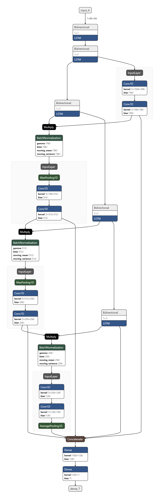

# Google-Brain-Ventilator-Pressure-Prediction
Top 6% solution(141/2,605 teams, solo bronze) for [Ventilator Pressure Prediction Competition](https://www.kaggle.com/c/ventilator-pressure-prediction).

## Models: bidirectional LSTM with conv1d layers/ bidirectional LSTM with 3-layed NN

|:--:| 
| *bidirectional LSTM with conv1d layers(2nd model)* |

Models are inspired by [the public model of the competition](https://www.kaggle.com/dlaststark/gb-vpp-pulp-fiction). <br />
 1. Using Conv1d Block(2convolutional 1d layers with the proper pooling) to give the model information about adjacent(nearby) features(1st model, increased the score 0.1392 -> 0.1347). <br />
 2. Using simple 3 dense layers(2nd model, increased the score 0.1392 -> 0.1360). <br />


## Post processing
This competiton is regression, but the steps of target values are consistent. Therefore I post-processed the predicted value to be one of the target values.
```
def post_process(pressure):
    pressure = np.round((pressure - PRESSURE_MIN) / PRESSURE_STEP) * PRESSURE_STEP + PRESSURE_MIN
    pressure = np.clip(pressure, PRESSURE_MIN, PRESSURE_MAX)
    return pressure
```
*post processing is only conducted before the submission*

## Ensemble
Tried median, lasso(linear regression). The best method(MEAN OR MEDIAN) was from [this discussion](https://www.kaggle.com/c/ventilator-pressure-prediction/discussion/282735). <br />
Instead of simple compute median or average of the predictions, this method keep *threshold* to decide whether to calculate median or average.  <br />
MEDIAN: 0.1327 <br />
LASSO: 0.1333 <br />
MEAN OR MEDIAN: 0.1325 <br />

## Pseudo labeling
The whole test data are provided during the competition which is the right situation for trying *pseudo labeling*. For pseudo labeling, the ensembled model(score 0.1325) is used. <br />
After labeling the test data, I retrained the model with the test data(1 epoch) and with the train data(1 epoch). <br />

## Final ensemble
For the final ensemble, I added following 4 models. The final score is The score is 0.1342(Public Score) and 0.1316(Private Score).
 1. further fine-tuning the public model with pseudo labeling
 2. 1st model
 3. 1st model with pseudo labeling
 4. 2nd model
